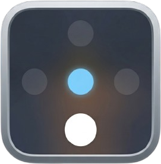

  

# Obsidian Nova

    

A desktop-style interface inside Obsidian: configurable grid layout, widgets, apps, multiple pages, and full keyboard navigation. Built for power users who want a hacker-friendly dashboard in their vault.

Plugin ID: `nova-desktop`

Companion plugin for widgets: [ObsidGet](https://github.com/infinition/obsidian-obsidget)

---

## Features

- Wallpaper, taskbar, and dock. Place widgets and apps on a configurable logical grid (default 36x36, range 12-64).
- Multiple pages: swipe or arrow keys to switch. Optional page names and atlas view (grid of all pages).
- Built-in widgets: Clock, Quick Note, Mini MD, Pomodoro, 2048, Snake, Tic-Tac-Toe, Chess AI, Calculator, System info, BTC ticker, Ping, Video, YouTube, IDE. All run inside Nova.
- ObsidGet widgets: import widgets from the ObsidGet plugin gallery (Kanban, Code Garden, Tamagotchi, etc.). Clearly separated in the Widget Gallery (All / Nova / ObsidGet tabs).
- Apps: Finder (vault browser, open notes) and Web (in-app browser). Open in panes or fullscreen.
- Drag to move, resize from bottom-right handle. Widgets auto-grow when content changes.
- Themes: Dark, Light, Obsidian (native CSS vars), Cyberpunk, Forest.
- Layout, config, and widget state saved in Obsidian plugin data.

---

## Grid and layout

- Placement: items have `x`, `y`, `cols`, `rows` in grid units. No overlap.
- Edit mode: click the pencil icon on the taskbar to move, resize, or delete. Click an item to open its edit modal. Click pencil again to lock.
- UI scale (50-150%) and widget scale (50-150%) are independent settings.

---

## Keyboard shortcuts

| Key | Action |
|-----|--------|
| Left / Right arrows | Change page |
| Home / End | Adjust UI scale |
| Page Up / Page Down | Adjust widget scale or grid density |

---

## Settings

- Bar position: Top, Bottom, Left, Right.
- Theme selection.
- Wallpaper (URL or vault path; supports video).
- Grid density (12-64).
- Page dots: position, size, blur.
- Transparent ObsidGet widgets toggle.

---

## Requirements

- Obsidian 1.5.0 or later.
- Optional: [ObsidGet](https://github.com/infinition/obsidian-obsidget) for imported widgets.

---

## Star History

<a href="https://www.star-history.com/?repos=infinition%2Fobsidian-nova&type=date&legend=top-left">
 <picture>
   <source media="(prefers-color-scheme: dark)" srcset="https://api.star-history.com/chart?repos=infinition/obsidian-nova&type=date&theme=dark&legend=top-left" />
   <source media="(prefers-color-scheme: light)" srcset="https://api.star-history.com/chart?repos=infinition/obsidian-nova&type=date&legend=top-left" />
   
 </picture>
</a>

---

## License

MIT. See [LICENSE](LICENSE).
